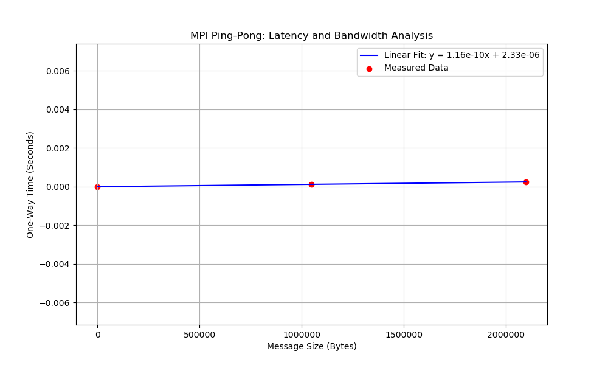

# Overview of Week 4 activities
This activity focuses on how MPI processes communnicate with eachother and how different methods affect performance.
The aim is to understand how processes exchange data, how communcation patterns can be impropved using collective operations, how performances can be measured using benchmarking.

## Instructions
### Activity 1:
The first activity was to demonstrate how MPI Communications routines work. 
The provided code *comm_test_mpi.c* was copied, complied and ran using the *mpicc* and *mpirun* commands. The program was run with different number of processes to observe its behaviour.

Next, the *comm_test_mpi.c* code was restrucutred to improve its readability. The original code had all its loigc within a single, long main() function, making it difficult to read and debug. 
To fix this, the code was split itnto smaller, manageable functions that each handle 1 specific task.
To do this, function prototypes were added at the top of the script to declare the new functions so htat they can be called on in the main body.

```
void root_task(int my_rank, int uni_size);
void client_task(int my_rank, int uni_size);
void check_task(int my_rank, int uni_size);
```
Next the Main function was simplified to only handle MPI setup and calls a manager function called *check_task*. 
```
if (uni_size > 1) {
    check_task(my_rank, uni_size);
}
```
This function checks the rank of the process and delegates the work to either the receiver or the sender.
```
void check_task(int my_rank, int uni_size) {
    if (0 == my_rank) {
        root_task(my_rank, uni_size);
    } else {
        client_task(my_rank, uni_size);
    }
}
```
To carry out the actual work, seperate functions called *root_task* and *client task* were created.
*root_task* contains the For loop and the MPI_Recv command that listens for messages from all the other processors. THis function is only run by rank 0.
*client_task* is ran by all the other ranks. It handles the *MPI_Send* command and calculates the unqiue messange that is sent to the root.


To study how the different communcation modes in MPI, the *comm_test_mpi_functionalised.c* program was modified to test 4 variants of the sned command
In each case, the *client_task* function was updated to replace the standard *MPI_send* with a specific variant.

#### MPI Bsend
This variant was implemented to allow the sender to continue its task immediately by copying the message into a local buffer.
This stops the sending process on having to wait for the root to be ready before sending the message.
Unlike the other variants, this required manual memory management using MPI_Buffer_attach and MPI_Buffer_detach.
```
int buffer_size = sizeof(int) + MPI_BSEND_OVERHEAD;
void* my_buffer = malloc(buffer_size);
MPI_Buffer_attach(my_buffer, buffer_size);

MPI_Bsend(&send_message, count, MPI_INT, dest, tag, MPI_COMM_WORLD);

MPI_Buffer_detach(&detached_ptr, &detached_size);
free(my_buffer);
```

#### MPI Rsend
This variant was implemented to study how ready communication works. This is a sppecialised mode that only works if the matching receive has already been posted by the root process.
It is designed to save the time usually spent talking between processors.
```
MPI_Rsend(&send_message, count, MPI_INT, dest, tag, MPI_COMM_WORLD);
```
#### MPI Ssend
THis variant was implemented to study a strict 'handshake' communication style. Unlike a standard send which could return early if there isnt enough system buffer space, *MPI_Ssend* is guaranteed to block until the receiver has started to receive data.
```
MPI_Ssend(&send_message, count, MPI_INT, dest, tag, MPI_COMM_WORLD);
```
#### MPI Isend
This variant was implemented to test asynchronous communication. This allows the processor to send the message and then immediately continue to the next line of code without waiting for the message to actually be sent.
```
MPI_Request request;
MPI_Status status;

// send the message and move on immediately
MPI_Isend(&send_message, count, MPI_INT, dest, tag, MPI_COMM_WORLD, &request);

//perfrom printing while send happens in background
printf("Hello, I am %d of %d. Sent %d to Rank %d\n", my_rank, uni_size, send_message, dest);

// wait for send to finish before moving on/changing the data
MPI_Wait(&request, &status);
```
To measure how long the communcation takes, the program was updated to include internal benchmarking. This allows for a direct measurement of how long each individual send and receive operation takes to complete.
*MPI_Wtime()* was used to record the timestamps as this function returns the elapsed wall clock time in seconds as a double precision float.
THis is needed as the time taken for a single message is extremely small that a standard integer would simply rounf the result to a 0. The double float ensures the necessary decimal places are kept.

In the *root_task* function, the timer was placed inside the capture the duration of each individual receive. This was done so a fair comaprison of the sender and receiver time could be done.
```
double start_time, end_time;
// ... inside the loop ...
start_time = MPI_Wtime();
MPI_Recv(&recv_message, count, MPI_INT, source, tag, MPI_COMM_WORLD, &status);
end_time = MPI_Wtime();
```
Similarily in the *client_task* function, the *MPI_Send* command was updated with the same timr functions
```
start_time = MPI_Wtime();
MPI_Send(&send_message, count, MPI_INT, dest, tag, MPI_COMM_WORLD);
end_time = MPI_Wtime();
```

### Activity 2:
To measure latency and communcation speeds between two processors, a program called *pingpong* was made. The script tracks how long it takes for a message to travel to and from a root process to a client over many repetitions.
The *chech_args* function was used to pull the number of pings from the command line, and a safety check was added to ensure that only 2 processes are used.
```
if (uni_size != 2) {
    if (my_rank == 0) fprintf(stderr, "Error: Ping-pong requires exactly 2 processes.\n");
    MPI_Finalize();
    return -1; }
```
The main logic of the code was placed in its own function called *run_pingpong*. To ensure that the timing results were accurate, an *MPI_Barrier* was used to sychronise both processes before the MPI_Wtime() clock started. This prevents the time from starting until both the root and client are ready to communicate.

Inside a while loop, the root sends the curent counter (ping) and then wiats to receive the updated counter (ping). THe client receives the counter, increases it by 1, and sends it back to the root.
```
while (counter < num_pings) {
    if (my_rank == 0) {
        MPI_Send(&counter, count, MPI_INT, 1, tag, MPI_COMM_WORLD);
        MPI_Recv(&counter, count, MPI_INT, 1, tag, MPI_COMM_WORLD, &status);
    } else {
        MPI_Recv(&counter, count, MPI_INT, 0, tag, MPI_COMM_WORLD, &status);
        counter++;
        MPI_Send(&counter, count, MPI_INT, 0, tag, MPI_COMM_WORLD);
    }
}
```
The program was then compiled usinf *mpicc* and ran using *mpirun* and as the pingpong logic requires a exchange between 2 specific objects, the -np 2 flag was used to limit the enviroment to 2 processes.
```
mpicc HPQC/week3/pingpong.c -o bin/pingpong
mpirun -np 2 bin/pingpong 10000
```

To see how the amount of data affects communication speed, the program was changed to *pingpong_bandwidth.c*, where it uses *malloc() to create a variable sized array that is sent back and forth instead of an integer.
The program was modified to accept a second command line argument that represents the number of elements in the array. 
THe aim is to vary the number of elements from a datasize of 8b to 2MiB. To keep track of the pings without sending extra messages, the counter was put inside the first element of the payload array.
```
int *payload = (int *)malloc(num_elements * sizeof(int));
for (int i = 0; i < num_elements; i++) payload[i] = 0;

while (payload[0] < num_pings) {
    if (my_rank == 0) {
        MPI_Send(payload, num_elements, MPI_INT, 1, 0, MPI_COMM_WORLD);
        MPI_Recv(payload, num_elements, MPI_INT, 1, 0, MPI_COMM_WORLD, MPI_STATUS_IGNORE);
    } else {
        MPI_Recv(payload, num_elements, MPI_INT, 0, 0, MPI_COMM_WORLD, MPI_STATUS_IGNORE);
        payload[0]++; // Increment counter inside the array
        MPI_Send(payload, num_elements, MPI_INT, 0, 0, MPI_COMM_WORLD);
    }}
```
Once the changes were made, it was compiled and ran similarily to before. To collect data for the analysis, the program was run multiple times with fixed numbers of pings while varying the 2nd argument. Since an *int* is 4 bytes, the following inputs were used to cover the required range:
8B = 2 elements
1KiB = 256 elements
1MiB = 262144 elements
2MiB = 524288 elements
```
mpicc HPQC/week3/pingpong_bandwidth.c -o bin/pingpong_bandwidth
mpirun -np 2 bin/pingpong_bandwidth 10000 524288
```
The results were recorded and processed using a python script. The script took the message size( bytes) as the x values and the one way time(seconds) as the y values and a linear regression was applied to the reults using *np.polyfit*.
```
x = np.array([8, 1048576, 2097152])   
y = np.array([0.000001, 0.000127, 0.000245])

# Linear fit: y = mx + c
m, c = np.polyfit(x, y, 1)

# Plotting the measured data against the linear trendline
plt.scatter(x, y, color='red', label='Measured Data')
plt.plot(x, m*x + c, color='blue', label=f'Linear Fit: y = {m:.2e}x + {c:.2e}')
```
The graph was saved as *bandwidth_plot.png* 
By analysising the linear equation y= mx+c, latency and bandwidth were determined.

### Actiivty 3:
In this activity, the efficiency of different data disturbution methods will be tested by modifiying the vector addition code from week3. The aim is to use MPI communications to replace point to point, manual pointer based and collective communications to see which handles large dataset the best.

The first approach is manual point to point titled vector_mpi_send.c. This version uses standard parallel approach where each process calculates the start and stop points based on its rank.
Each process independently computes its part of the math and sends only the final *partial_sum* back to the root.
```
if (rank != 0) {
    MPI_Send(&partial_sum, 1, MPI_INT, 0, 0, MPI_COMM_WORLD);
} else {
    MPI_Recv(&received_sum, 1, MPI_INT, source, 0, MPI_COMM_WORLD, &status);
}
```
The second approach is manual pointer logic titled *vector_mpi_diy.c*. In this version, the root process creates the entrire array in its memory first. It then manually loops through every other rank and sends a specific slice of the array using pointer arithmethic to find the correct starting location in memory.
```
if (rank == 0) {
    for (int i = 1; i < size; i++) {
        MPI_Send(full_vector + (i * chunk), chunk, MPI_INT, i, 0, MPI_COMM_WORLD);
    }
}
```
The third appraoch is collective communication titled *mpi_scatter.c*. This version replaces the manual loops and pointer math with *MPI_scatter*.This collective routine takes the large array at the root and automatically splits it into equal chunks, distributing them to all processes, including itself, in a single operation.
```
MPI_Scatter(full_vector, chunk, MPI_INT, local_vector, chunk, MPI_INT, 0, MPI_COMM_WORLD);
```
The last approach is *mpi_broadcast.c*. This version ensures that every process has a complete, identical copy of the full vector in its local memory. 
Each process then uses its rank to determine which specific part of the shared vector it is responsible for summing.
```
MPI_Bcast(my_vector, num_arg, MPI_INT, 0, MPI_COMM_WORLD);

int start_idx = rank * chunk;
int local_sum = sum_vector(&my_vector[start_idx], chunk);
```

The next part was to find the most effiecient way to collect results from parallel processes,  by modifing the vector addition code to compare three different methods of gathering data. These sre Manual Send/Recv loops, MPI_Gather and MPI_Reduce.
The aim is to determine which approach is the best for performance.

The first approach is manual collection. Like done previously, the manual appraoch requires each cleint to send it result to teh root and thr root will run a for loop with *MPI_Recv* to collect them one by one.

The second approach is result collection using MPI_Gather which is used to automate the colllection of partial sums. 
Instead of sending multiple send/receive calls, a single collective command takes the partial sum ffrom every process  into a preallocated array on the root.
```
if (rank == 0) all_sums = malloc(size * sizeof(int));

MPI_Gather(&partial_sum, 1, MPI_INT, all_sums, 1, MPI_INT, 0, MPI_COMM_WORLD);

if (rank == 0) {
    for (int i = 0; i < size; i++) final_sum += all_sums[i];
}
```
The third approach, mpi_reduce, is used as a specialised solution for this task. It gathers data by performing a mathematical operation during the collection process itself.
```
// Every process participates in a single collective sum
MPI_Reduce(&partial_sum, &final_sum, 1, MPI_INT, MPI_SUM, 0, MPI_COMM_WORLD);
```

The last part is to compare the collective oprations for a custom reduction operation and a predefined MPI operation *MPI_SUM.
First a function called *my_sum* was created to follow a strict MPI template to handle the input data anf the running total. Pointer casting was used to ensure the data was treated as integers
void my_sum(void *invec, void *inoutvec, int *len, MPI_Datatype *datatype)
```
{
    int *in = (int *)invec;
    int *inout = (int *)inoutvec;

    for (int i = 0; i < *len; i++)
    {
        inout[i] += in[i]; // Adds the incoming data to the total
    }
}
```
In the main function, the *MPI_Op_create* coomand was used to register the new function with the MPI enviroment which created a handle called *my_op* that MPI recognises as a valid reduction tool.
```
MPI_Op my_op;
MPI_Op_create(&my_sum, 1, &my_op);
```
*my_op* was then passed directly into the *MPI_Reduce* function, which replaced the *MPI_SUM* used in previous steps.
```
MPI_Reduce(&partial_sum, &final_sum, 1, MPI_INT, my_op, 0, MPI_COMM_WORLD);
```
Once reduction was completed and the result printed, *MPI_Op_free* was called to release the custom operation and clean the memory before the program ended.
```
MPI_Op_free(&my_op);
```

## Results
### Activity 1:
The program was ran with 2,4, and 8 processes and in all cases each non root process sent a value to the root process, which then received and printed the messages.
For 2 processes, a single messge was sent and received s expected. For 4 and 8 processes, multiple processes sent messages to the root and it was seen that all messages were successfuflly received by the root, the values sent were proprtional to the rank (i.e rank 3 sent 30) and the order of the output messages varied between runs
An example output of a run from a 4 processes was:
```
No protocol specified
Hello, I am 3 of 4. Sent 30 to Rank 0
Hello, I am 0 of 4. Received 10 from Rank 1
Hello, I am 0 of 4. Received 20 from Rank 2
Hello, I am 0 of 4. Received 30 from Rank 3
Hello, I am 1 of 4. Sent 10 to Rank 0
Hello, I am 2 of 4. Sent 20 to Rank 0
```
For part 2, the code was restrucutured into seperate functions and the program was tested by running it with 4 processes.
The results showed that the same messages were snet and received as in the original version, it produced the same numerical result, and the ordering of messages was still varied. 
Output looked like this:
```
No protocol specified
Hello, I am 3 of 4. Sent 30 to Rank 0
Hello, I am 2 of 4. Sent 20 to Rank 0
Hello, I am 1 of 4. Sent 10 to Rank 0
Hello, I am 0 of 4. Received 10 from Rank 1
Hello, I am 0 of 4. Received 20 from Rank 2
Hello, I am 0 of 4. Received 30 from Rank 3
```

For part 3, the program was tested using 4 different MPI send variants to observe change in behaviour and reliability. Each test was performed with 4 processes.

| Command | Result | Performance Observation |
| :--- | :--- | :--- |
| `MPI_Ssend` | Success | Rank 0 received all messages; workers blocked until the handshake was confirmed. |
| `MPI_Bsend` | Success | Required manual buffer allocation; workers returned from the send call immediately. |
| `MPI_Rsend` | Success | Completed successfully, but remains prone to failure if the receiver is not already waiting.| 
| `MPI_Isend` | Success | Used `MPI_Request` and `MPI_Wait`; allowed local tasks to continue during transmission. |

For part 4 benchmarking was used to capture the length of time it takes for each communication to happen for 4 processes.
| Rank | Operation | Target/Source | Measured Time (s) |
| :--- | :--- | :--- | :--- |
| 0 | Receive | Rank 1 | 0.000113 |
| 0 | Receive | Rank 2 | 0.000001 |
| 0 | Receive | Rank 3 | 0.000032 |
| 1 | Send | Rank 0 | 0.000010 |
| 2 | Send | Rank 0 | 0.000014 |
| 3 | Send | Rank 0 | 0.000021 |

### Activity 2:
The *pingpong* program was executed using -np 2 to measure the time taken to exchange messages between a single root and a single client. 
| Input (num_pings) | Final Counter | Total Elapsed Time (s) | Avg. Round-Trip Time (s) |
| :--- | :--- | :--- | :--- |
| 10 | 10 | 0.000026 | 0.000003 |
| 1000 | 1000 | 0.001052 | 0.000001 |
| 100000 | 100000 | 0.060396 | 0.000001 |

The *pingpong_bandwidth* program was executed with -np 2 to measure how different data sizes affect transfer speed. The tests used a constant of 1000 pings while varying the number of elements in the array  from 8 bytes to 2 MiB.

| Input (Pings) | Input (Elements) | Size (Bytes) | Avg. One-Way (s) | Bandwidth (MiB/s) |
| :--- | :--- | :--- | :--- | :--- |
| 1000 | 2 | 8 | 0.000001 | 13.39 |
| 1000 | 262,144 | 1,048,576 | 0.000127 | 7884.85 |
| 1000 | 524,288 | 2,097,152 | 0.000245 | 8154.92 |

Data was processed and plotted in python script.

Linear fit was applied to the data to find calculated latency and bandwidth.
```
Calculated Latency (c): 2.33 microseconds (0.00000233 s)
Calculated Bandwidth (1/m): 8196.69 MiB/s
```
### Activity 3:
All following tests were conducted using -np 4.
#### Part 1
| Program | Input Size (N) | Processes (-np) | Final Sum | Time (s) |
| :--- | :--- | :--- | :--- | :--- |
| vector_add_mpi_broadcast.c | 12 | 4 | 506 | 0.000177 |
| vector_add_mpi_diy.c | 12 | 4 | 506 | 0.000065 |
| vector_add_mpi_scatter.c | 12 | 4 | 506 | 0.000096 |

#### Part 2:
| Method | Input Size (N) | Processes (-np) | Final Sum | Time (s) |
| :--- | :--- | :--- | :--- | :--- |
| vector_mpi_send.c | 10 | 4 | 285 | 0.000013 |
| vector_mpi_gather.c | 10 | 4 | 285 | 0.000031 |
| vector_mpi_reduce.c | 10 | 4 | 285 | 0.000027 |

#### Part 3:
| Input Size (N) | Final Sum | Predefined (s) | Custom (s) |
| :--- | :--- | :--- | :--- |
| 10 | 285 | 0.000027 | 0.000054 |
| 100000 | 216,474,736 | 0.000186 | 0.000176 |
| 10000000 | -1,039,031,360 | 0.013279 | 0.011366 |

## Discussion
### Activity 1:
#### Part 1:
It can be seen from running *comm_test_mpi* with 2,4, and 8 processors confirmed tha MPI processes oprate independently and asynchronously. It was seen that while the root received all the messages in the correct logical order, the physicial timing of the sent and recieved print statements was random. This confirms that in parallel processing, process ID doesn't dictate execution order.
#### Part 2:
This test showed that spliting the code into seperate functions for root and client didn't change how the program works. The results were identical to the original version, with the sent messages appeared in a random order and the received message staying in logical order. This is a clear sign of parallel processing as the processes didn't wait for eachother to reach the print command.
#### Part 3:
After running the 4 modified codes for each send variant, different behaviours were observed between the processes.

Ssend was the safest and most predicatable as it forces the sender to wait until the receiver has started collecting the messages before the code moves on. This make it certain that the data was delivered. On the downside this makes the code slower but it is made up for with how good it is at preventing errors in complex programs and is one of the best choices for general use as its so reliable.
Bsend was reliable for preventing processes get stuck waiting for each other forever. This is due to the message being stored in a manual buffer instead of the systems memory. This makes the sender more efficient by letting it continue almost immediately, but it adds a lot of extra work for the programmer and you have to calculate the correct buffer size and remeber to manually detach and free the memory to avoid leaks.
Rsend was the least reliable option as it frequently crashed. THis is due to the root process needing to receive the messages in a strict 1,2,3 order. If a higher order rank sneds its message before the root is ready for it, it immediately crashes the program. This makes it unsuitable for a project unless you will have the receiver always waiting.
Isend was the most complex but the most effiecient as it uses a request object to track the message which allows the processor to keep working on other tasks while the data is sent in the background. THe downside is that it requires a wait command at the end and without it, the program can crash. THis mode is best for high performance code where you want calculations to be performed whilst communication is happening.

#### Part 4:
From benchmarking the code it can be seen that the computational times for each function is very short. There was a large difference between the time to receive from Rank 1 and Rank 2, which is likely due to Rank 2's message waiting on Rank 1 to finish so it could be collected. As the times are very short, they can be easily affected by the systems noise
This suggests that internal timing is much more useful for large tasks than for sending single small numbers.

### Activity 2:
#### Part 2:
It was seen from running the *pingpong.c* code for a high number of iterations was nessecary for getting an accurate result. In smaller test, the noise for the system made timing inconsistent and was smoothed out by averaging the time over thousands of pings. THis provided a stable measurement of the actual time it tales for a message to travel between 2 processes. The results show that as the number of iterations increases, the average time per round trip becomes more consistent. This confirms that the initial cost of starting a communication is a constant factor that stays the same regardless of how many pings are sent.
A safety test was also done with an inout of 100,000 and np 4, which succesfully triggered the internal error check: "Error: Ping-pong requires exactly 2 processes.
This confirmed that the program's error handling ensures that the code only runs when the correct number of participants is present. It was also seen that the order of printed messages varied between the runs. This is expected as the processes run independently and communication timing is not stricitly ordered, leading to differnt processes reaching their print statements at slightly different times.

#### Part 3:
The results from the bandwidth tests show that the size of the message changes what limits the speed of the program. For very small messages, the system is limited by latency, however as the array size increase, the time per round trip begins to grow linerarly. This suggests that once the message is large enough, the bottleneck shifts from latency to badwidth, which is the max speed at which the hardware can push per second.
From the python script latency and bandwidth were found. The y intercept (c) confirmed a low latency of 2.33 microseconds, which is the minimum time needed for any coomunication to happen. The gradient (m) showed that there is a high bandwidth of 8196.69 MiB/s which confirms that the cluster is effiecent at moving large datasets as the transfer speed stays fast and predicitable even as the message size increases to several megabytes.

### Activity 3:
#### Part 1:
It was found that for a very small workload, the diy method was the fastest. This happened as the amount of data was small enoguh that the time spent setting up a collective like MPI_Scatter or MPI_Broadcast was actually longer than just sending the data. However the diy method is harder to write and maintain as it needs complex pointer math, which would make MPI_Scatter the better choicr for real applications as it automatically handles the splitting of the data ans scales better as the array size grows.
#### Part 2:
FFor collecting results back to the root, it was found that MPI_Send/Recv was the quickest for small test. Among the collective options MPI_reduce was much faster than MPI_Gather as MPI_gather has to bring every single message back to the root, and then sum them up through a loop. This makes MPI_Reduce more efficient as it save time by performing the math while the data is still moving through the network, saving the root from doing extra work.
#### Part 3:
Through the comparison of the predefined MPI_SUM vs the custom reduce function, it can be seen that both programs produce identical results across all the tested sizes. At the largest scale, both programs correctly showed an integer overflow, proving the logic was consistent.
While the custom version performed well, the predefined version generally performed better due to its faster speeds as its highly optimised for the hardware, while the custom version needs the program to jump to a user defined function during every step of the reduction.

