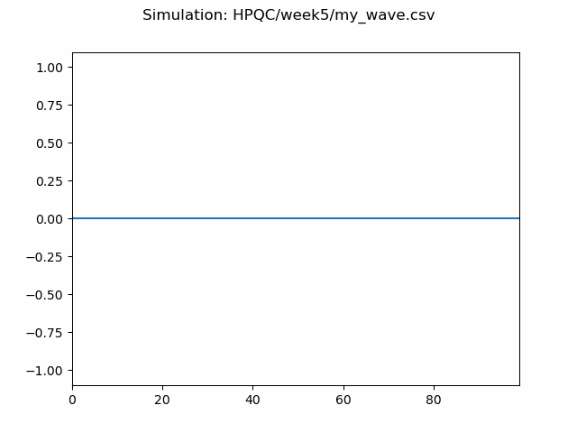
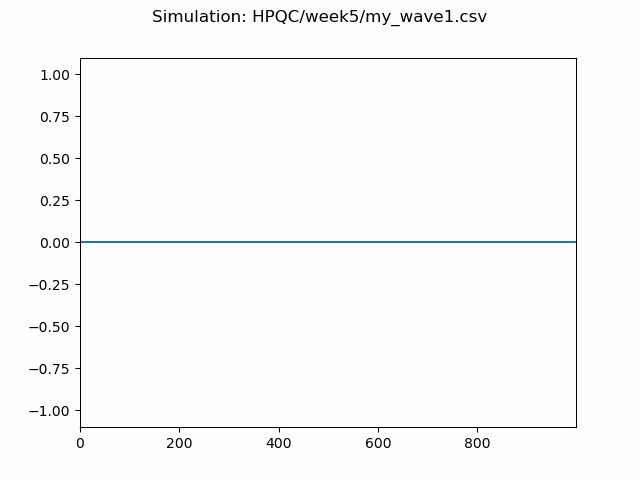
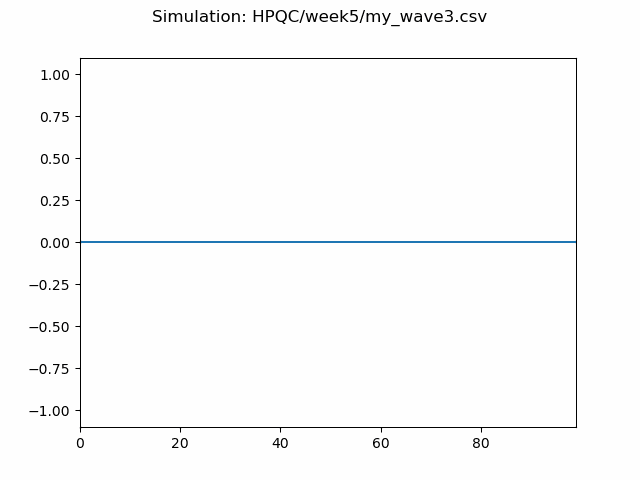

# Overview of Week 5 activities
Each activity focused on simulating and improving on the dynamics of a vibrating string.
The begining excercises focused on creating a basic C program to simulate wave propagation slong a string and generating data  to animate it.
Then Runge Kutta methods, spring mass, and damping was added to make the program more realisitic followed by parallel processing to speed up the simulations
The main aims was to built a simulation, visualise the results and improve on accuracy and computational speed.

## Instructions
### Activity 1:
#### Step 1:
The repo material was updated to make sure all file were up to data. THis was done by pulling the latest version of the materials from the class folder into the personal HPQC folder. 

#### Step 2:
In this part, the *string_wave*.c program was compiled and ran to simulate a basic wave along a one dimensional string. This is done by using a driver function which uses a sine wave to create simple harmonic motion.
```
double driver(double time) {
    return sin(time * 2.0 * M_PI);
}
```
At each timestep, the positions are updated and written to a csv file.
```
for (int i = 0; i < time_steps; i++)
{
    update_positions(positions, points, time_stamps[i]);
}

fprintf(out_file, "%d, %lf", i, time_stamps[i]);
for (int j = 0; j < points; j++)
{
    fprintf(out_file, ", %lf", positions[j]);
}
```

The program was compiled similarly to previous weeks but with the addition of -lm flag as the code includes the math library *math.h*. Once compiled, the code was ran with a numerical argument to define the number of points on the string.
```
gcc HPQC/week5/string_wave.c -o bin/string_wave -lm
./bin/string_wave 50
```

This creates a file *string_wave.csv* inside the data directory, which was verified to check it existed after execution of the code.
*string_wave.csv* was visualised by processing the numbers into a python script called *animate_line_file.py*, which reads the csv file and creates an animated GIF of the wave.
```
python3 PHY/week5/animate_line_file.py data/string_wave.csv
```

#### Step 3:
In this step the program was modified to remove hard coding values, with the files being renamed to *my_string_wave.c* and *my_animated_string_file.py*.
In the original code, parameters including string point, simulation cycles, and file path were fixed within the code. These have been updated to accept user defined inputs for four desired variables; points, cycles, samples, and output file. 
These represent the number of points on the string, number of oscillation cycles to simulate, number of samples per cycle, and a file path for the generated CSV output.
A check to ensure that the correct number of arguments were provided as added by converting the string to integers using *atoi()* while the filename for the output file was taken directly from the command line.
```
if (argc != 5) {
    fprintf(stderr, "Usage: %s <points> <cycles> <samples> <output_file>\n", argv[0]);
    exit(-1);
}

int points = atoi(argv[1]);
int cycles = atoi(argv[2]);
int samples = atoi(argv[3]);
char* filename = argv[4];
```
The file handling was updated to check that the file opened correctly before writing to the file.
```
FILE* out_file = fopen(filename,"w");
if (out_file == NULL) {
    fprintf(stderr, "ERROR: Could not open file %s\n", filename);
    exit(-1);
}
```
In the python script, the hard coded input and output files were removed and replaced with the user defined arguments.
```
 python3 HPQC/week5/my_animate_line_file.py HPQC/week5/my_wave.csv HPQC/week5/my_wave1.gif
```

The script now reads the data from the CSV file using the pandas library and determines how many points are in the simulation from the data which removes the need for the fixed array sizes.
```
 # use pandas to read the csv made in c
        df = pd.read_csv(input_file, comment='#', header=None)
        # column 1 is time, columns 2 onwards are the y-positions
        times = df.iloc[:, 1].values
        y_data_matrix = df.iloc[:, 2:].values
```
From this the animation is created and saved to the user specified output file.
```
# save to the output name provided in the arguments
    print(f"Saving animation to {output_file}...")
    ani.save(output_file, writer='pillow', fps=25)
    print("Done!")
```
The code was compiled and ran similarly to previous weeks excersices. To study the visual changes of the graph, a baseline gif was created. Subsequnetly, 3 comparitive gifs were made with each changing 1 varaible at a time to observe the resulting modifications in the visual output.
```
gcc HPQC/week5/my_string_wave.c -o bin/my_string_wave -lm
./bin/my_string_wave 1000 5 25 HPQC/week5/my_wave1.csv
python3 HPQC/week5/my_animate_line_file.py HPQC/week5/my_wave1.csv HPQC/week5/my_wave1.gif
```

### Activity 2
#### Step 1:
To scale the model to a very large level, the *string_wave.c* program needs to be changed from sequential to parallel. The program simulates a wave on a one-dimensional string, updating an array of positions at each timestep, where each point depends on its neighbor. To do this, the patterns of iteration need to be studied to determine which parts can be parallelised and how this will be done.
In the original code, the main calculations happen in two nested loops where the outer loop for every time step it updates the string position and the inner loop, for every position on the string, it calculates the new position based on the previous point.
It's clear that each updated point's position depends on the left neighbour, which is data dependent and can’t be parallelised. However for the points not adjacent they can be updated independently once the boundary values are communicated between neighboring partitions. Therefore, timesteps must be sequential, while the points along the string can be calculated in parallel, with processors exchanging boundary values to maintain the continuity of the wave.
To implement this, the string is divided into multiple chunks with each chunk assigned to a separate processor. Each processor is responsible for updating only the points within its allocated section. A boundary communication step is used at each timestep to manage the data. In this process, each rank sends the value of its last point to the next rank using MPI_Send and MPI_Recv to ensure that every section has the necessary boundary data from its left neighbour to perform its update. The driver point which is the first point of the string is handled by rank 0 and travels through the rest of the string through these neighbour exchanges.

#### Step 2:
After modifying the code to be parallel, it creates an issue with the original code. In the original code, the data is written directly to a file at the same time, however in parallelisation allowing multiple processes to write into the same file simultaneously is unsafe and can corrupt the data. 
To fix this an aggregation strategy was made to bring the results from all the processors together into a single file. This is to be done by sending all computed data to rank 0, which will then send everything to the output file via collective communication.
At each timestep, each process computes their portion of the string, send it onto rank 0, who will collect and combine all portions into a full string and write it to the file.
This aggregation occurs in memory which allows the data to be collected and organised before writing to the disk. By performing the aggregation in memory it avoids multiple processes writing to the file at the same time and ensures that the output remains consistent while maintaining good performance.

#### Step 3:
To implement the parallel and aggregated strategies, versions of the *my_string_wave.c* code were created and modified.
First the parallel strategy was implemented by duplicating the hard coded values code and naming it *string_wave_parallel.c* . It was modified to include the MPI header and initialises the parallel environment. MPI_Finalise was added at the end of the program to properly close the environment.
```
#include <mpi.h>
MPI_Init(&argc, &argv);
MPI_Comm_rank(MPI_COMM_WORLD, &rank);
MPI_Comm_size(MPI_COMM_WORLD, &size);
```

The code divides the points along the string into equal amounts across all processes, where each computes its chunk independently and updates its position at each timestep. This is done to simplify the aggregation step later, where the number of points be divisible equally across all processes is easier to manage than odd amounts.
```
int local_points = points / size;
int start_index = rank * local_points;
```

The neighbouring processes swap boundary values to maintain the correct propagation of the wave along the string.
```
// Communicate left boundary with neighbor
if (rank > 0)
    MPI_Recv(&left_value, 1, MPI_DOUBLE, rank - 1, 0, MPI_COMM_WORLD, MPI_STATUS_IGNORE);

if (rank < size - 1)
    MPI_Send(&positions[local_points - 1], 1, MPI_DOUBLE, rank + 1, 0, MPI_COMM_WORLD);
```

In this code only Rank 0 writes its chunk to the output file, stopping corruption from simultaneous writes.
```
if (rank == 0)
{
    fprintf(out_file, "%d, %lf", t, time);
    for (int j = 0; j < local_points; j++)
        fprintf(out_file, ", %lf", positions[j]);
    fprintf(out_file, "\n");
}
```

The aggregated strategy was implemented by duplicating the parallelised code and naming it *string_wave_aggregated.c* where the strategy is added after updating the positions, all processes send their data to rank 0 using *MPI_Gather*
```
MPI_Gather(positions, local_points, MPI_DOUBLE,
            all_positions, local_points, MPI_DOUBLE,
            0, MPI_COMM_WORLD);
```

Rank 0 collects and combines all chunks in memory to form the complete string at each timestep before writing to the CSV file.
```
 if (rank == 0) {
    fprintf(out_file, "%d, %lf", t, time);
    for (int j = 0; j < points; j++)
        fprintf(out_file, ", %lf", all_positions[j]);
    fprintf(out_file, "\n");
}
```
Temporary buffers for gathering data are allocated and freed at each timestep to ensure no memory leaks. 

#### Step 4:
Finally the program was compiled and ran across multiple processors to verify correct operation.
```
mpicc my_string_wave_aggregated.c -o bin/string_wave_mpi
mpirun -np 4 bin/string_wave_mpi 50 5 25 data/output.csv
```
The results were compared with the serial version to ensure correctness, and the output files were visualised using the Python script to confirm that the wave behaviour remained consistent.

### Part 3
To improve on the realism of the wave simulation, the *sting_wave.c* model was updated in multiple stages. The original code uses a simple idea that each point on the line will take the value of the previous value of the next point along, which gives a smooth but unrelatisitc behaviour . To fix this, additional properties and more advanced numerical methods were introduced with each modification building on the previous one, resulting in a more realistic representation of a wave's motion.
The first change added was a velocity vector and replaced the simple update method with RUnge KUtta (RK4) which is a higher order numerical method.
Velocity was added as physical systems evolve on position and velocity. In the original code only position was tracked which limited how realistic the simulation was. To track velocity the code had to be modified by adding a new *velocity* array in *main()*, updating the *update_position()* function to include velocity and replacing the simple update step with RK4 calculations.
```
double* velocity = (double*) malloc(points * sizeof(double));
initialise_vector(velocity, points, 0.0);
```

RK4 was chosen as it gives a more accurate approximation of motion than a simple method like EUler integration. Instead of calculating a single slope per timestep,  *rk4_update()* computes intermediate slopes (k1,k2,k3,k4) to approximate how the system evolves over a timestep. This was implemented across the entire string allowing both velocity and position to be updated using the intermediate steps.
```
pos[i] += (dt/6.0)*(k1x[i] + 2*k2x[i] + 2*k3x[i] + k4x[i]);
vel[i] += (dt/6.0)*(k1v[i] + 2*k2v[i] + 2*k3v[i] + k4v[i]);
```

Next a mass spring system was added to model the interactions between the points on a string. In the orignal code, each point evolved independently with the exception of the shift in its position. In this system each point is treated as a mass connected to its neighbouring point via a string.
This was done by modifying the *update_positions()* function to calculate forces using Hooke’s law where the force on each point depends on the difference between its position and the position of the neighbouring points. 
```
if(i>0) f += -k*(pos[i]-pos[i-1]);
if(i<points-1) f += -k*(pos[i]-pos[i+1]);
```

The forces were then converted into acceleration using Newton’s second law and then used to update velocity and position.
```
vel[i] += acc[i]*dt;
pos[i] += vel[i]*dt;
```
Finally, a damping term was added to simulate the energy loss within the system as in physical systems, oscillations can decrease from friction or resistance which hadn’t been accounted for in the previous models. This made waves that continued indefinitely. 
To implement this, the damping term was added as a force proportional to velocity.
```
f += -b*vel[i]; // damping
```

## Results:
### Activity 1:
#### Part 2:
When the program was executed it produces a CSV file, *string_wave.csv* in the *data/* directory. The file contained the time evolution of the string’s displacement with each row in the file representing the start of the system at each time step, and columns representing the index, time, and displacement of each point.
When running the Python script, the following error messages were displayed
```
Unable to init server: Could not connect: Connection refused
Gdk-CRITICAL ...
```
These errors indicate that the program couldn't connect to a graphical display server as there is non available on powershell. To check if both codes had properly ran the data directory was checked to confirm the presence of both *string_wave.csv* and *animate_file.gif*. Both were seen to be there and confirmed that the script had successfully bypassed the display error to save the final *animate_file.gif* and *string_wave.csv* files.

#### Part 3:
During execution, similar display related errors were encountered to part 2.
Again, despite the warnings,  the script successfully completed execution and saved the animation file, as indicated by the message printed to the screen.
```
Saving animation to data/wave_1.gif...  
Done!
```
| Simulation Name | Points ($N$) | Cycles ($C$) | Samples ($S$) | 
| :--- | :--- | :--- | :--- | 
| **Baseline** | 100 | 5 | 25 | 
| **my_wave1** | 1000 | 5 | 25 | 
| **my_wave2** | 100 | 20 | 25 |
| **my_wave3** | 100 | 5 | 5 | 






### Activity 2:
#### Part 3/Part 4:
The simulation was tested in parallel with 4 processes and compared with the serial simulations. The number of points were varied to study how performance scales with problem size, with the number of cycles and samples per cycle were fixed to 5 and 25 respectively.

| Points     | Serial Real (s) | Serial User (s) | Serial Sys (s) | Parallel Real (s) | Parallel User (s) | Parallel Sys (s) |
|------------|-----------------|-----------------|----------------|-------------------|-------------------|------------------|
| 100 | 0.016 | 0.007 | 0.004 | 0.449 | 0.167 | 0.141 |
| 1,000 | 0.04 | 0.028 | 0.004 | 0.481 | 0.266 | 0.187 |
| 10,000 | 0.368 | 0.236 | 0.012 | 0.828 | 1.276 | 0.182 |
| 100,000 | 3.178 | 2.276 | 0.221 | 4.749 | 12.443 | 0.459 |
| 1,000,000 | 35.192 | 22.990 | 1.042 | 33.085 | 116.761 | 1.532 |

From the results it can be seen that for small size problems, the serial version is much faster than parallel. At 100,000 points the serial version still performs faster than the parallel version but the differences between the two are minimal. It's not until 1,000,000 for the parallel version to become slightly faster than the serial version.
THe user time was seen to be much higher in parallel compared to the serial simulations, which is expected, as user time accumulates CPU usage across all processes and with as user time accumulates CPU usage across all processes and with multiple processors working simultaneously, the total CPU time increases even if the overall real execution time decreases.
The csv files generated by the parallel program were successfully read by the animation script. For 100 and 1,000 points both simulations produced identical waveforms however as the number points increased, the longer it took the x axis for the points to appear. For larger numbers of points, the waveform remains correct, but appears visually compressed along the x-axis, giving the appearance of a rectangular shape due to the increased spatial resolution. 

### Activity 3:

## Discusion
### Activity 1:
#### Part 2:
The string wave simulation successfully generated time-dependent position data and showed correct wave propagation behaviour. Testing confirmed that the program produced a valid CSV file. 
Even though the graphical display issues prevented direct viewing of the animation during execution, the successful creation of output files indicated that the underlying simulation logic was functioning correctly. The error encountered is related to the graphical display environment rather than the simulation as the scripts tries to render the animation using a display server which isn’t available in powershell
The gif was uploaded to github where it could be viewed and it could be seen that the simulation successfully demonstrates wave propagation along a discretised string. The driving function, defined as a sine wave, continuously inputs oscillatory motion at one end of the string. This motion is transferred along the array of points by shifting position values between neighbouring elements at each time step. The resulting animation confirms that the disturbance travels in one direction, with a clear phase delay between successive points

#### Part 3:
The removal of hard-coded values improved the flexibility and usability of both programs. In the original code, the key parameters like number of cycles and number of points on the string were fixed and prevented testing different models. With the updated code, these values can be changed to try out different configurations to see how the parameters affect the behaviour and visual quality of the wave propagation. From testing it was seen that varying the parameters had quite an effect on the wave. 
To be able to do a comparison a baseline wave was created. This produced a sinusoidal wave propagating across 100 points, with 25 samples per cycle, and 5 cycles per duration. The motion appeared fluid and lasted long enough to see the wave transition from the driver to the end of the visible string. The resolution was good though it appeared a little jaggedned at the crest and troughs of the wave.
By increasing the points to 1000, the string got rid of the jaggedness seen in the baseline with the wavelength appearing more compacted , however the wave travels slower across the screen as the propagation now needs 10 times more steps to cover the same distance.
Increasing the number of cycles from 5 to 20 maintained the wave looking exactly like the baseline with the only difference being its runtime being much longer. In the baseline the gif only shows 5 periods, while this version gave 20.
Decreasing the sample rate from 25 to 5 reduced the sampling density. As the code only calculates 5 positions per period, the gif looks choppy and isn't as fluid as the baseline. This shows a minimum sampling threshold is required to represent a continuous wave accurately.

### Activity 2:
#### Part 4:
For the parallel and aggregated strategies it was found that the effectiveness of parallelisation is strongly dependent on the size of the problem.
For small size problems, the parallel model performs worse than the serial version which is due to the overhead introduced by the MPI operations. For these cases the cost of having multiple processes outweighs computational benefit.
As the number of points increased, the workload becomes larger and the effect of the MPI overhead decreases. This causes the parallel version to improve to similar timing as the serial version but still slightly slower. It doesn't outperform the serial version until 1,000,000 points which suggests that the parallel version is only beneficial for very large sized problems.
Therefore the activity doesn’t need parallelisation for small to medium size problems but it is advantageous for very large simulations as the workload can offset the cost of the overhead. 

### Activity 3:
